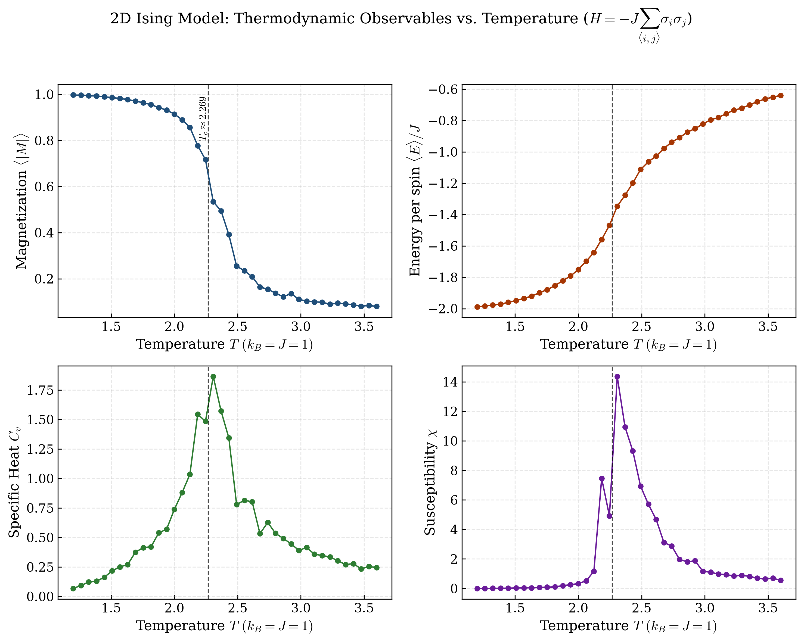
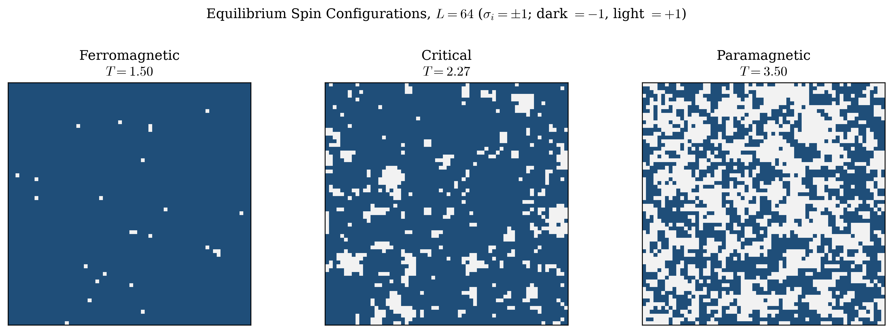
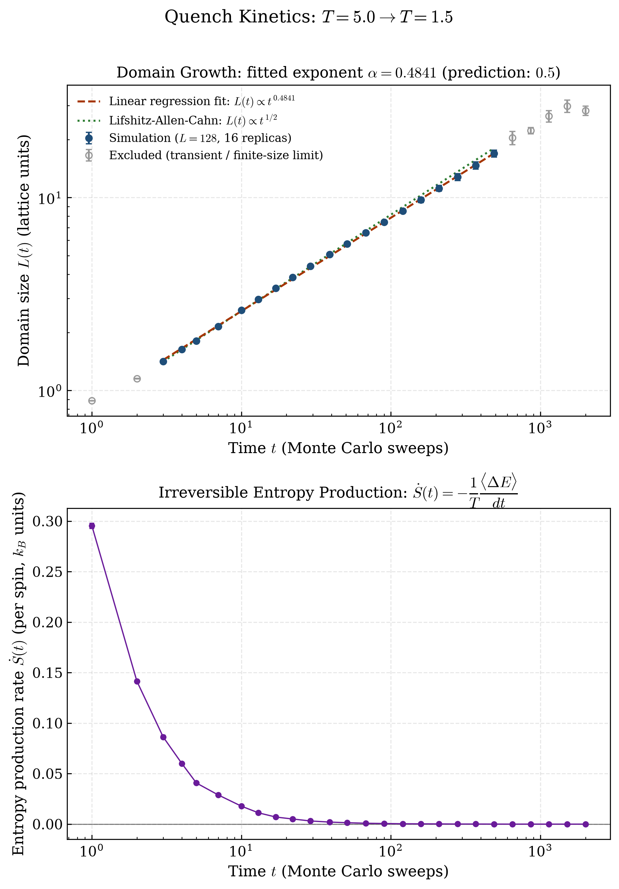

# 2D Ising Model Monte Carlo Engine

**🔴 [Live Demo](https://djangothompson12-alt.github.io/ising-monte-carlo/)** — real-time Metropolis dynamics running in-browser via HTML5 Canvas, with live Chart.js plots of magnetization and energy.

A from-scratch, Numba-accelerated Metropolis Monte Carlo simulation of the two-dimensional square-lattice Ising model, built to generate quantitative thermodynamic data (order parameter, energy, specific heat, and susceptibility) across the ferromagnetic phase transition.

This engine was developed as the computational component of a research paper examining statistical-mechanical entropy and its relationship to philosophical treatments of time (eternalism / the "block universe" view). The code below is self-contained physics and simulation infrastructure; it makes no philosophical claims on its own.

<p align="center">
  
</p>

<p align="center">
  
</p>

## Physics background

The model places a spin $\sigma_i \in \{-1, +1\}$ on every site of an $L \times L$ square lattice with periodic boundary conditions. The energy of a configuration is given by the Ising Hamiltonian

$$
H = -J \sum_{\langle i,j \rangle} \sigma_i \sigma_j
$$

where $J$ is the nearest-neighbor coupling constant (set to $J = 1$ throughout) and $\langle i,j \rangle$ denotes a sum over nearest-neighbor bonds, each counted once. For $J > 0$, aligned neighboring spins are energetically favored, producing ferromagnetic order at low temperature.

Configurations are sampled from the Boltzmann distribution $P(\sigma) \propto e^{-\beta H(\sigma)}$ (with $k_B \equiv 1$, $\beta = 1/T$) using single-spin-flip **Metropolis dynamics**: a randomly chosen spin is flipped with probability

$$
P(\text{accept}) = \min\left(1,\ e^{-\beta \Delta E}\right)
$$

where $\Delta E$ is the energy change of the flip. This update rule satisfies detailed balance with respect to the Boltzmann distribution, so long Markov chains of these moves converge to thermal equilibrium.

### Observables

At each temperature, after discarding an equilibration (burn-in) period, the simulation collects samples spaced by several sweeps (to reduce autocorrelation) and estimates four per-spin observables, where $N = L^2$:

**Magnetization** (order parameter):

$$
\langle |M| \rangle = \frac{1}{N}\left\langle \left| \sum_i \sigma_i \right| \right\rangle
$$

**Energy:**

$$
\langle E \rangle = \frac{1}{N} \langle H \rangle
$$

**Specific heat**, from energy fluctuations (fluctuation–dissipation theorem):

$$
C_v = \frac{1}{N T^2}\left( \langle H^2 \rangle - \langle H \rangle^2 \right)
$$

**Magnetic susceptibility**, from magnetization fluctuations:

$$
\chi = \frac{1}{N T}\left( \langle M^2 \rangle - \langle |M| \rangle^2 \right)
$$

$C_v$ and $\chi$ are both response functions and, in the thermodynamic limit, diverge at the critical temperature — the simulation reproduces this as sharp finite-size peaks. The exact critical temperature for this model (Onsager, 1944) is

$$
T_c = \frac{2}{\ln(1+\sqrt{2})} \approx 2.269\ (J/k_B)
$$

which is marked as a vertical reference line in the generated figures.

### Non-equilibrium quench kinetics

<p align="center">
  
</p>

Quenching the lattice from a disordered high-temperature state ($T_{\text{initial}} = 5.0 \gg T_c$) to an ordered low-temperature state ($T_{\text{final}} = 1.5 < T_c$) leaves the system far from equilibrium: rather than relaxing instantly, ferromagnetic domains nucleate and then coarsen, growing over time. For this **non-conserved** order parameter (single-spin-flip dynamics, no magnetization conservation), phase-ordering theory predicts curvature-driven interfacial motion obeying the **Lifshitz–Allen–Cahn growth law**

$$
L(t) \sim t^{1/2}
$$

The characteristic domain size $L(t)$ is extracted from the equal-time spatial spin-autocorrelation function

$$
C(r, t) = \langle \sigma_i(t)\, \sigma_{i+r}(t) \rangle
$$

(averaged over lattice sites and the two principal lattice directions) as the lattice distance $r$ at which $C(r, t)$ first decays to $1/2$, linearly interpolated between the bracketing integer separations. `run_quench_kinetics` (in `ising_engine.py`) averages this over many independent quench replicas and samples $C(r,t)$ at logarithmically spaced sweep counts, since the growth is expected to be a power law in time.

**Entropy production.** The lattice is coupled to a heat bath at fixed $T_{\text{final}}$: every accepted Metropolis flip changes the system's energy by $\Delta E$, and by conservation of energy the bath absorbs heat $-\Delta E$ over that move. Summing accepted $\Delta E$ within each inter-checkpoint interval gives an estimate of the (per-spin) irreversible entropy production rate

$$
\dot{S}(t) = -\frac{1}{T}\frac{\langle \Delta E \rangle}{dt}
$$

which is non-negative for a relaxing system and is expected to decay towards zero as domain walls annihilate and accepted moves become rarer — the system's dissipation subsides as it approaches a slowly coarsening, quasi-equilibrium state.

## Repository structure

```
.
├── index.html          # Standalone live demo (Canvas + Chart.js, no build step)
├── ising_engine.py     # Numba-jitted Metropolis MC core + observable calculation
├── visualizer.py       # Publication-quality figure generation (matplotlib)
├── main.py             # CLI entry point: runs the sweep, saves data + figures
├── plot_kinetics.py    # Quench simulation + domain-growth/entropy-production plot
├── requirements.txt
├── figures/             # Generated PNGs (fig1, fig2, fig3)
├── results/             # Generated observables.csv, quench_kinetics.csv
└── manuscript/          # main.tex (revtex4-2 PRL format) + compiled main.pdf
```

### Live demo (`index.html`)

A self-contained, single-file browser simulation — open `index.html` directly (or visit the [live demo](https://djangothompson12-alt.github.io/ising-monte-carlo/)) to run Metropolis dynamics interactively at ~60 FPS. It reimplements the same physics as `ising_engine.py` (including an external field term $H = -J\sum_{\langle i,j\rangle}\sigma_i\sigma_j - H\sum_i \sigma_i$) directly in JavaScript, rendered with an HTML5 Canvas pixel buffer, with live [Chart.js](https://www.chartjs.org/) plots of magnetization and energy. Sliders control temperature, external field, lattice size, and sweeps per frame — no build step or server required.

- **`ising_engine.py`** — `SimulationConfig` (lattice size, temperature range, equilibration/sampling sweeps), the JIT-compiled Metropolis sweep and energy/magnetization kernels, and `run_temperature_sweep` / `sample_snapshot` for producing sweep-level and single-temperature results.
- **`visualizer.py`** — `plot_phase_transitions` (4-panel $|M|$, $E$, $C_v$, $\chi$ vs. $T$) and `plot_spin_domains` (lattice snapshots at representative temperatures).
- **`main.py`** — orchestrates a full run: temperature sweep → `results/observables.csv` → `figures/fig1_phase_transitions.png` and `figures/fig2_spin_domains.png`.
- **`plot_kinetics.py`** — runs a $T_{\text{initial}} \to T_{\text{final}}$ quench via `ising_engine.run_quench_kinetics`, saves `results/quench_kinetics.csv`, fits a power law to the domain-growth scaling regime, and renders the two-panel `figures/fig3_kinetics_entropy.png` ($L(t)$ scaling fit on top, entropy production rate $\dot{S}(t)$ below).

## Installation

Requires Python 3.10–3.13.

```bash
git clone https://github.com/<your-username>/ising-monte-carlo.git
cd ising-monte-carlo
python3 -m venv .venv
source .venv/bin/activate   # Windows: .venv\Scripts\activate
pip install -r requirements.txt
```

> **Note (Intel macOS only):** numba's PyPI wheels for `x86_64` macOS stop at version `0.62.1`; on Intel Macs, pin with `pip install "numba==0.62.1"` before installing the rest of `requirements.txt`. Apple Silicon, Linux, and Windows are unaffected.

## Usage

Run the full pipeline with default parameters ($L=24$, $T \in [1.2, 3.6]$, 40 temperature points):

```bash
python main.py
```

This prints progress to stdout, writes `results/observables.csv`, and generates both figures in `figures/`. A full run at the defaults completes in well under a minute on a modern laptop (Numba JIT-compiles the Metropolis kernel on first call).

Customize the simulation via CLI flags:

```bash
python main.py \
  --L 32 \
  --t-min 1.0 --t-max 4.0 --n-temperatures 60 \
  --eq-sweeps 5000 --mc-sweeps 6000 --sample-interval 4 \
  --seed 7
```

| Flag | Default | Description |
|---|---|---|
| `--L` | 24 | Lattice dimension ($L \times L$ spins) |
| `--J` | 1.0 | Nearest-neighbor coupling |
| `--t-min`, `--t-max` | 1.2, 3.6 | Temperature sweep range |
| `--n-temperatures` | 40 | Number of temperature points |
| `--eq-sweeps` | 3000 | Equilibration (burn-in) sweeps per temperature |
| `--mc-sweeps` | 4000 | Sampling sweeps per temperature |
| `--sample-interval` | 4 | Sweeps between successive samples |
| `--seed` | 42 | Base random seed |
| `--domain-L` | 64 | Lattice size used only for the `fig2` spin-domain snapshots |

### Using the engine directly

```python
from ising_engine import SimulationConfig, run_temperature_sweep, sample_snapshot

config = SimulationConfig(L=32, t_min=1.5, t_max=3.0, n_temperatures=30)
result = run_temperature_sweep(config)   # result.temperatures, .magnetization, .energy, ...

lattice = sample_snapshot(T=2.269, config=config, seed=0)  # (L, L) array of +-1
```

### Quench kinetics

```bash
python plot_kinetics.py
```

Runs a $T=5.0 \to T=1.5$ quench (default: $L=128$, 16 independent replicas, 2000 sweeps), writes `results/quench_kinetics.csv` ($t$, $L(t)$ and its standard error, $\dot{S}(t)$ and its standard error), fits the domain-growth power law over the genuine scaling regime, and saves `figures/fig3_kinetics_entropy.png`. On the same hardware as the pipeline above, this takes under a minute; with the default configuration and seed it gives a fitted exponent $\alpha = 0.4841$, within about 3% of the Lifshitz–Allen–Cahn prediction of $0.5$ (reproducible bit-for-bit given the fixed seed, though it will shift slightly with different parameters, replica counts, or seeds).

```python
from ising_engine import QuenchConfig, run_quench_kinetics

config = QuenchConfig(L=64, T_initial=5.0, T_final=1.5, n_replicas=8, max_sweeps=1000)
result = run_quench_kinetics(config)
# result.t, .domain_size, .domain_size_err, .entropy_production, .entropy_production_err
```

### Manuscript

[`manuscript/main.pdf`](manuscript/main.pdf) is a short Physical Review Letters–format writeup ("Quantifying Phase-Ordering Kinetics and Non-Equilibrium Entropy Production in the Two-Dimensional Ising Quench") built from [`manuscript/main.tex`](manuscript/main.tex) with `revtex4-2`, covering the theoretical background, methodology, and results above in full, citation-backed detail. Rebuild it with:

```bash
cd manuscript && pdflatex main.tex && pdflatex main.tex
```

(two passes, to resolve citations and cross-references).

## Verification

The generated `fig1_phase_transitions.png` shows the expected signatures of a second-order phase transition: $\langle |M| \rangle$ drops from near 1 to near 0 across $T_c$, $\langle E \rangle$ rises smoothly, and both $C_v$ and $\chi$ peak sharply near $T_c \approx 2.269$ — consistent with Onsager's exact solution. `fig2_spin_domains.png` shows a single dominant magnetic domain at $T = 1.5$, scale-spanning clusters at $T \approx T_c$, and fine-grained disorder at $T = 3.5$. `fig3_kinetics_entropy.png`'s top panel shows $L(t)$ tracking the predicted $t^{1/2}$ line closely across roughly two decades of Monte Carlo time (fitted exponent $\alpha = 0.4841$); points from the earliest post-quench sweeps (lattice-discreteness transient) and the latest sweeps (where $L(t)$ approaches the periodic lattice's finite-size limit) are shown but excluded from the power-law fit, and are visibly where the data departs from the scaling line. Its bottom panel shows $\dot{S}(t)$ falling from $\approx 0.295$ to $\approx 1.2\times 10^{-5}$ (per spin, $k_B$ units) — over four orders of magnitude — over the same window, consistent with dissipation being concentrated at domain-wall annihilation events that become rarer as coarsening proceeds.

## License

MIT

## Model B: Conserved Kawasaki Dynamics & Anisotropy

Everything above (`ising_engine.py`, `visualizer.py`, `main.py`, `plot_kinetics.py`, `index.html`, `manuscript/`) implements **Model A** in the Hohenberg–Halperin classification: single-spin-flip Metropolis dynamics, in which the order parameter is *not* conserved. [`model_b/`](model_b/) is a fully standalone addition implementing the complementary case, **Model B**: Kawasaki spin-exchange dynamics, in which total magnetization $\sum_i \sigma_i$ is exactly conserved. It does not import, modify, or depend on any file outside `model_b/`.

### Physics

Rather than flipping a single spin, a Kawasaki move picks a random nearest-neighbor pair and proposes to *exchange* them, with Metropolis acceptance $\min(1, e^{-\beta \Delta E})$. Swapping two equal spins is a no-op; swapping unlike spins conserves $\sum_i \sigma_i$ by construction. This module also generalizes the Hamiltonian to independent horizontal/vertical couplings,

$$
H = -J_x \sum_{\langle i,j \rangle_x} \sigma_i \sigma_j \;-\; J_y \sum_{\langle i,j \rangle_y} \sigma_i \sigma_j,
$$

so the two coarsening directions can be compared directly. The critical temperature generalizes Onsager's exact result to the anisotropic case as the root of $\sinh(2J_x/T_c)\sinh(2J_y/T_c) = 1$ (`anisotropic_critical_temperature`, solved numerically; reduces to $T_c = 2J/\ln(1+\sqrt2)$ when $J_x = J_y = J$), and is used to set the quench temperatures automatically ($T_{\text{initial}} = 3\,T_c$, $T_{\text{final}} = 0.65\,T_c$) whenever they aren't given explicitly.

Because the order parameter is conserved, phase separation here is diffusion-limited rather than curvature-driven, and Hohenberg–Halperin theory predicts the slower **Lifshitz–Slyozov growth law** $L(t) \sim t^{1/3}$, in contrast to Model A's $t^{1/2}$. The directional domain sizes $L_x(t)$ and $L_y(t)$ are extracted independently (rather than axis-averaged) from $C_x(r,t)$ and $C_y(r,t)$, each computed via the same 2D-FFT / Wiener–Khinchin approach used in the root engine. Entropy production $\dot{S}(t) = -\frac{1}{T}\langle \Delta E \rangle / dt$ is tracked identically to the Model A quench, from the energy change of *accepted exchanges*.

The exchange energy-change formula and magnetization conservation were both checked directly against an independent brute-force recomputation of the full lattice Hamiltonian before any production run (exact match, not just "close").

### Directory structure

```
model_b/
├── kawasaki_engine.py   # Numba-jitted Kawasaki MC core, anisotropic couplings,
│                         #   directional FFT correlations, entropy production
├── run_simulation.py    # Launcher: runs the quench, saves CSV + figure
├── figures/               # fig_anisotropic_kinetics.png
└── results/               # kawasaki_kinetics.csv
```

### Usage

```bash
python model_b/run_simulation.py
```

Default configuration: $L=96$, $J_x=1.0$, $J_y=0.5$ (so $T_c(J_x,J_y) \approx 1.641$, giving $T_{\text{initial}} \approx 4.923 \to T_{\text{final}} \approx 1.067$), 16 replicas, 10000 sweeps. This takes roughly a minute and a half on the same hardware as the root pipeline, and writes `results/kawasaki_kinetics.csv` ($t$, $L_x(t)$, $L_y(t)$, $\dot{S}(t)$, all with standard errors) plus `figures/fig_anisotropic_kinetics.png`.

```python
import sys
sys.path.insert(0, "model_b")
from kawasaki_engine import KawasakiConfig, run_quench_kinetics

config = KawasakiConfig(L=64, Jx=1.0, Jy=0.5, n_replicas=8, max_sweeps=4000)
result = run_quench_kinetics(config)
# result.t, .domain_size_x, .domain_size_y, .entropy_production, and their standard errors
```

### Results

At the default configuration, $L_x(t)$ grows visibly faster than $L_y(t)$ throughout the run (e.g. $L_x \approx 4.0$ vs. $L_y \approx 1.9$ lattice units by $t=10{,}000$ sweeps), correctly reflecting the stronger horizontal coupling $J_x > J_y$. The entropy production rate falls from $\dot{S}(t{=}1) \approx 0.151$ to $\dot{S}(t{=}10{,}000) \approx 7.3\times 10^{-6}$ (per spin, $k_B$ units) — again over four orders of magnitude, as in Model A.

Fitting $L_x(t)$ and $L_y(t)$ over the same style of trimmed scaling regime used for Model A gives effective exponents $\alpha_x \approx 0.18$ and $\alpha_y \approx 0.14$ — both well below the asymptotic Lifshitz–Slyozov prediction of $1/3$. This is expected, not a defect: conserved-order-parameter coarsening is well documented to have much stronger and longer-lived corrections to its asymptotic growth law than the non-conserved case, so an effective exponent well below $1/3$ at Monte-Carlo-accessible timescales (here, up to $10^4$ sweeps) is the physically correct outcome, not a fitting artifact — domain sizes reach only a small fraction of the periodic lattice's finite-size limit ($r_{\max}=48$) by the end of the run, so the shortfall isn't finite-size saturation either. Reaching closer to $1/3$ would require substantially longer runs than were practical to include here.
