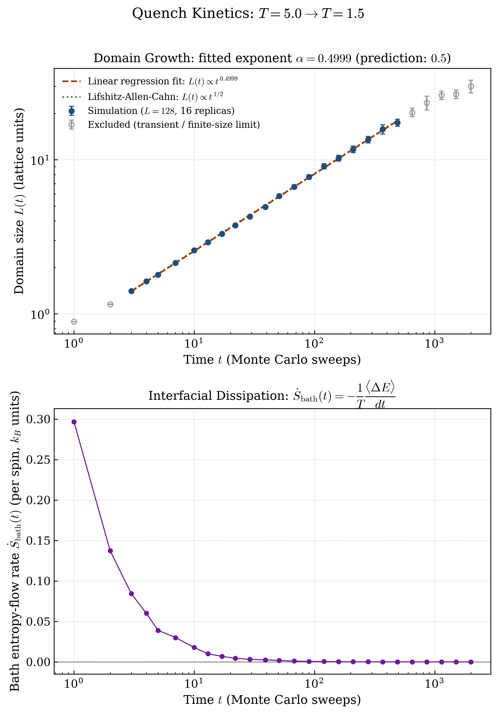

# 2D Ising Model Quench Dynamics: Glauber (Model A) vs. Kawasaki (Model B) Kinetics

**🔴 [Live Demo](https://djangothompson12-alt.github.io/ising-monte-carlo/)** — real-time Model A dynamics running in-browser via HTML5 Canvas, with live Chart.js plots of magnetization and energy.

Independent research project, completed during a gap year, on non-equilibrium phase-ordering kinetics in the two-dimensional Ising model. The question driving it: how does the conservation law obeyed by an order parameter's microscopic dynamics change the exponent governing domain growth after a temperature quench?

Two dynamics answer this differently, and both are implemented here from scratch. **Model A** — single-spin-flip dynamics, in which the order parameter $M = \sum_i \sigma_i$ is *not* conserved — is predicted by phase-ordering theory to coarsen via curvature-driven interfacial motion, the **Lifshitz–Allen–Cahn growth law** $L(t) \propto t^{1/2}$. **Model B** — nearest-neighbor spin-exchange dynamics, in which $M$ is conserved exactly — coarsens by a slower, diffusion-limited process, the **Lifshitz–Slyozov growth law** $L(t) \propto t^{1/3}$. This repository contains two independent Numba-accelerated Monte Carlo engines (plus a pure-JavaScript reimplementation of Model A), extracts the characteristic domain size $L(t)$ from the spin-autocorrelation function of each, and fits the resulting scaling exponents against both predictions.

*A terminology note, since it matters for precision:* the move-acceptance rule implemented for Model A throughout this codebase is **Metropolis** ($P_\text{accept} = \min(1, e^{-\beta\Delta E})$), not the Glauber rate function ($P_\text{accept} = 1/(1+e^{\beta\Delta E})$) in the strict sense. Both are non-conserved single-spin-flip dynamics belonging to the same Hohenberg–Halperin **Model A** universality class, and both produce the same asymptotic growth exponent — "Glauber dynamics" is used in the title in the broad sense common in the phase-ordering-kinetics literature (e.g. Bray, *Adv. Phys.* 1994) for non-conserved single-spin-flip dynamics generally, not as a claim that the specific rate function is Glauber's.

<p align="center">
  
</p>

<p align="center">
  
</p>

## Physics background

The model places a spin $\sigma_i \in \{-1, +1\}$ on every site of an $L \times L$ square lattice with periodic boundary conditions. The energy of a configuration is given by the Ising Hamiltonian

$$
H = -J \sum_{\langle i,j \rangle} \sigma_i \sigma_j
$$

where $J$ is the nearest-neighbor coupling constant (set to $J = 1$ throughout) and $\langle i,j \rangle$ denotes a sum over nearest-neighbor bonds, each counted once. For $J > 0$, aligned neighboring spins are energetically favored, producing ferromagnetic order at low temperature.

Configurations are sampled from the Boltzmann distribution $P(\sigma) \propto e^{-\beta H(\sigma)}$ (with $k_B \equiv 1$, $\beta = 1/T$) using single-spin-flip **Metropolis dynamics**: a randomly chosen spin is flipped with probability

$$
P(\text{accept}) = \min\left(1,\ e^{-\beta \Delta E}\right)
$$

where $\Delta E$ is the energy change of the flip. This update rule satisfies detailed balance with respect to the Boltzmann distribution, so long Markov chains of these moves converge to thermal equilibrium.

### Observables

At each temperature, after discarding an equilibration (burn-in) period, the simulation collects samples spaced by several sweeps (to reduce autocorrelation) and estimates four per-spin observables, where $N = L^2$:

**Magnetization** (order parameter):

$$
\langle |M| \rangle = \frac{1}{N}\left\langle \left| \sum_i \sigma_i \right| \right\rangle
$$

**Energy:**

$$
\langle E \rangle = \frac{1}{N} \langle H \rangle
$$

**Specific heat**, from energy fluctuations (fluctuation–dissipation theorem):

$$
C_v = \frac{1}{N T^2}\left( \langle H^2 \rangle - \langle H \rangle^2 \right)
$$

**Magnetic susceptibility**, from magnetization fluctuations:

$$
\chi = \frac{1}{N T}\left( \langle M^2 \rangle - \langle |M| \rangle^2 \right)
$$

$C_v$ and $\chi$ are both response functions and, in the thermodynamic limit, diverge at the critical temperature — the simulation reproduces this as sharp finite-size peaks. The exact critical temperature for this model (Onsager, 1944) is

$$
T_c = \frac{2}{\ln(1+\sqrt{2})} \approx 2.269\ (J/k_B)
$$

which is marked as a vertical reference line in the generated figures.

### Non-equilibrium quench kinetics

<p align="center">
  
</p>

Quenching the lattice from a disordered high-temperature state ($T_{\text{initial}} = 5.0 \gg T_c$) to an ordered low-temperature state ($T_{\text{final}} = 1.5 < T_c$) leaves the system far from equilibrium: rather than relaxing instantly, ferromagnetic domains nucleate and then coarsen, growing over time. For this **non-conserved** order parameter (single-spin-flip dynamics, no magnetization conservation), phase-ordering theory predicts curvature-driven interfacial motion obeying the **Lifshitz–Allen–Cahn growth law**

$$
L(t) \sim t^{1/2}
$$

The characteristic domain size $L(t)$ is extracted from the equal-time spatial spin-autocorrelation function

$$
C(r, t) = \langle \sigma_i(t)\, \sigma_{i+r}(t) \rangle
$$

(averaged over lattice sites and the two principal lattice directions) as the lattice distance $r$ at which $C(r, t)$ first decays to $1/2$, linearly interpolated between the bracketing integer separations. `run_quench_kinetics` (in `model_a/ising_engine.py`) averages this over many independent quench replicas and samples $C(r,t)$ at logarithmically spaced sweep counts, since the growth is expected to be a power law in time.

**Entropy production.** The lattice is coupled to a heat bath at fixed $T_{\text{final}}$: every accepted Metropolis flip changes the system's energy by $\Delta E$, and by conservation of energy the bath absorbs heat $-\Delta E$ over that move. Summing accepted $\Delta E$ within each inter-checkpoint interval gives an estimate of the (per-spin) irreversible entropy production rate

$$
\dot{S}(t) = -\frac{1}{T}\frac{\langle \Delta E \rangle}{dt}
$$

which is non-negative for a relaxing system and is expected to decay towards zero as domain walls annihilate and accepted moves become rarer — the system's dissipation subsides as it approaches a slowly coarsening, quasi-equilibrium state.

## Repository structure

```
.
├── index.html                  # Model A live demo (Canvas + Chart.js, no build step)
├── comparative_analysis.py     # Reads both models' CSVs, plots L(t) scaling side by side
├── requirements.txt
├── manuscript/                  # main.tex (revtex4-2 PRL format) + compiled main.pdf
├── figures/                      # fig_comparative_scaling.png (from comparative_analysis.py)
├── model_a/                    # Model A: non-conserved order parameter (Metropolis)
│   ├── ising_engine.py           # Numba-jitted Metropolis MC core + observable calculation
│   ├── visualizer.py              # Publication-quality figure generation (matplotlib)
│   ├── main.py                    # CLI entry point: runs the sweep, saves data + figures
│   ├── plot_kinetics.py           # Quench simulation + domain-growth/entropy-production plot
│   ├── figures/                    # Generated PNGs (fig1, fig2, fig3)
│   └── results/                    # Generated observables.csv, quench_kinetics.csv
└── model_b/                    # Model B: conserved order parameter (Kawasaki) -- see below
    ├── kawasaki_engine.py         # Numba-jitted Kawasaki MC core, anisotropic couplings,
    │                                #   directional FFT correlations, entropy production
    ├── plot_kawasaki_kinetics.py  # Launcher: runs the quench, saves CSV + figure
    ├── live_visualizer.py         # Native desktop dashboard (matplotlib + Tk)
    ├── solara_app.py              # Web dashboard (Solara)
    ├── figures/                    # fig_anisotropic_kinetics.png
    └── results/                    # kawasaki_kinetics.csv
```

### Live demo (`index.html`)

A self-contained, single-file browser simulation — open `index.html` directly (or visit the [live demo](https://djangothompson12-alt.github.io/ising-monte-carlo/)) to run Model A dynamics interactively at ~60 FPS. It reimplements the same physics as `model_a/ising_engine.py` (including an external field term $H = -J\sum_{\langle i,j\rangle}\sigma_i\sigma_j - H\sum_i \sigma_i$) directly in JavaScript, rendered with an HTML5 Canvas pixel buffer, with live [Chart.js](https://www.chartjs.org/) plots of magnetization and energy on locked axes matching the Matplotlib figures below. Sliders control temperature, external field, lattice size, and sweeps per frame; three preset buttons jump directly to a low-temperature quench, the critical point, and the high-temperature paramagnetic phase. A "Download Run Data (CSV)" button exports lattice size, sweep count, $M(t)$, $E(t)$, and an estimated domain size $L(t)$ for direct comparison against the Python pipeline's output. No build step or server required.

- **`model_a/ising_engine.py`** — `SimulationConfig` (lattice size, temperature range, equilibration/sampling sweeps), the JIT-compiled Metropolis sweep and energy/magnetization kernels, and `run_temperature_sweep` / `sample_snapshot` for producing sweep-level and single-temperature results.
- **`model_a/visualizer.py`** — `plot_phase_transitions` (4-panel $|M|$, $E$, $C_v$, $\chi$ vs. $T$) and `plot_spin_domains` (lattice snapshots at representative temperatures).
- **`model_a/main.py`** — orchestrates a full run: temperature sweep → `results/observables.csv` → `figures/fig1_phase_transitions.png` and `figures/fig2_spin_domains.png`.
- **`model_a/plot_kinetics.py`** — runs a $T_{\text{initial}} \to T_{\text{final}}$ quench via `ising_engine.run_quench_kinetics`, saves `results/quench_kinetics.csv`, fits a power law to the domain-growth scaling regime, and renders the two-panel `figures/fig3_kinetics_entropy.png` ($L(t)$ scaling fit on top, entropy production rate $\dot{S}(t)$ below).

## Installation

Requires Python 3.10–3.13.

```bash
git clone https://github.com/djangothompson12-alt/ising-monte-carlo.git
cd ising-monte-carlo
python3 -m venv .venv
source .venv/bin/activate   # Windows: .venv\Scripts\activate
pip install -r requirements.txt
```

> **Note (Intel macOS only):** numba's PyPI wheels for `x86_64` macOS stop at version `0.62.1`; on Intel Macs, pin with `pip install "numba==0.62.1"` before installing the rest of `requirements.txt`. Apple Silicon, Linux, and Windows are unaffected.

## Usage

Run the full pipeline with default parameters ($L=24$, $T \in [1.2, 3.6]$, 40 temperature points):

```bash
python model_a/main.py
```

This prints progress to stdout, writes `model_a/results/observables.csv`, and generates both figures in `model_a/figures/`. A full run at the defaults completes in well under a minute on a modern laptop (Numba JIT-compiles the Metropolis kernel on first call).

Customize the simulation via CLI flags:

```bash
python model_a/main.py \
  --L 32 \
  --t-min 1.0 --t-max 4.0 --n-temperatures 60 \
  --eq-sweeps 5000 --mc-sweeps 6000 --sample-interval 4 \
  --seed 7
```

| Flag | Default | Description |
|---|---|---|
| `--L` | 24 | Lattice dimension ($L \times L$ spins) |
| `--J` | 1.0 | Nearest-neighbor coupling |
| `--t-min`, `--t-max` | 1.2, 3.6 | Temperature sweep range |
| `--n-temperatures` | 40 | Number of temperature points |
| `--eq-sweeps` | 3000 | Equilibration (burn-in) sweeps per temperature |
| `--mc-sweeps` | 4000 | Sampling sweeps per temperature |
| `--sample-interval` | 4 | Sweeps between successive samples |
| `--seed` | 42 | Base random seed |
| `--domain-L` | 64 | Lattice size used only for the `fig2` spin-domain snapshots |

### Using the engine directly

```python
import sys
sys.path.insert(0, "model_a")
from ising_engine import SimulationConfig, run_temperature_sweep, sample_snapshot

config = SimulationConfig(L=32, t_min=1.5, t_max=3.0, n_temperatures=30)
result = run_temperature_sweep(config)   # result.temperatures, .magnetization, .energy, ...

lattice = sample_snapshot(T=2.269, config=config, seed=0)  # (L, L) array of +-1
```

### Quench kinetics

```bash
python model_a/plot_kinetics.py
```

Runs a $T=5.0 \to T=1.5$ quench (default: $L=128$, 16 independent replicas, 2000 sweeps), writes `model_a/results/quench_kinetics.csv` ($t$, $L(t)$ and its standard error, $\dot{S}(t)$ and its standard error), fits the domain-growth power law over the genuine scaling regime, and saves `model_a/figures/fig3_kinetics_entropy.png`. On the same hardware as the pipeline above, this takes under a minute; with the default configuration and seed it gives a fitted exponent $\alpha = 0.4841$, within about 3% of the Lifshitz–Allen–Cahn prediction of $0.5$ (reproducible bit-for-bit given the fixed seed, though it will shift slightly with different parameters, replica counts, or seeds).

```python
import sys
sys.path.insert(0, "model_a")
from ising_engine import QuenchConfig, run_quench_kinetics

config = QuenchConfig(L=64, T_initial=5.0, T_final=1.5, n_replicas=8, max_sweeps=1000)
result = run_quench_kinetics(config)
# result.t, .domain_size, .domain_size_err, .entropy_production, .entropy_production_err
```

### Manuscript

[`manuscript/main.pdf`](manuscript/main.pdf) is a short Physical Review Letters–format writeup ("Quantifying Phase-Ordering Kinetics and Non-Equilibrium Entropy Production in the Two-Dimensional Ising Quench") built from [`manuscript/main.tex`](manuscript/main.tex) with `revtex4-2`, covering the theoretical background, methodology, and results above in full, citation-backed detail. Rebuild it with:

```bash
cd manuscript && pdflatex main.tex && pdflatex main.tex
```

(two passes, to resolve citations and cross-references).

## Verification

The generated `fig1_phase_transitions.png` shows the expected signatures of a second-order phase transition: $\langle |M| \rangle$ drops from near 1 to near 0 across $T_c$, $\langle E \rangle$ rises smoothly, and both $C_v$ and $\chi$ peak sharply near $T_c \approx 2.269$ — consistent with Onsager's exact solution. `fig2_spin_domains.png` shows a single dominant magnetic domain at $T = 1.5$, scale-spanning clusters at $T \approx T_c$, and fine-grained disorder at $T = 3.5$. `fig3_kinetics_entropy.png`'s top panel shows $L(t)$ tracking the predicted $t^{1/2}$ line closely across roughly two decades of Monte Carlo time (fitted exponent $\alpha = 0.4841$); points from the earliest post-quench sweeps (lattice-discreteness transient) and the latest sweeps (where $L(t)$ approaches the periodic lattice's finite-size limit) are shown but excluded from the power-law fit, and are visibly where the data departs from the scaling line. Its bottom panel shows $\dot{S}(t)$ falling from $\approx 0.295$ to $\approx 1.2\times 10^{-5}$ (per spin, $k_B$ units) — over four orders of magnitude — over the same window, consistent with dissipation being concentrated at domain-wall annihilation events that become rarer as coarsening proceeds.

## Model B: Conserved Kawasaki Dynamics & Anisotropy

> **Live demo:** the previous badge here pointed at a Streamlit Community Cloud deployment (`anisotropic-materials-sim.streamlit.app`). The web dashboard has since been rebuilt on Solara (see below), which that platform can't host — Streamlit Cloud only runs Streamlit apps, and `model_b/solara_app.py` no longer imports `streamlit` at all, so the old deployment will break once this change reaches it. No replacement deployment exists yet; run it locally with the instructions below in the meantime.

### Executive summary

This module simulates **anisotropic, conserved-order-parameter phase separation** and connects it to three real materials phenomena. **Binary alloy spinodal decomposition** is close to a literal correspondence: this simulation *is* the standard lattice-gas model of a quenched A/B alloy, with conserved magnetization standing in for conserved alloy composition and the measured $t^{1/3}$ growth law matching the Lifshitz–Slyozov description of precipitate coarsening (Ostwald ripening) used in metallurgy. **Directional grain alignment in rolled sheet metals** is a looser but genuinely useful parallel — rolling imposes a preferred direction via plastic deformation rather than diffusion, but the qualitative outcome (elongated, texture-aligned grains along one axis) is the same *shape* of phenomenon that $J_x \neq J_y$ produces here. **Single-crystal superalloy turbine blade microstructures** are the closest real-world analog to the anisotropy mechanism specifically: Ni-based superalloys grown as single crystals undergo directional $\gamma'$ precipitate coarsening ("rafting") under applied stress, driven by elastic anisotropy — an external asymmetry biasing which direction domains preferentially grow along, exactly like $J_x \neq J_y$ biases $L_x(t)$ vs. $L_y(t)$ in this model.

Model A (above: `model_a/`, plus `index.html` and `manuscript/` at the repo root) is the Hohenberg–Halperin classification's non-conserved case: single-spin-flip dynamics, in which the order parameter is *not* conserved. [`model_b/`](model_b/) is a fully standalone implementation of the complementary case, **Model B**: Kawasaki spin-exchange dynamics, in which total magnetization $\sum_i \sigma_i$ is exactly conserved. It does not import, modify, or depend on any file outside `model_b/`.

### Physics

Rather than flipping a single spin, a Kawasaki move picks a random nearest-neighbor pair and proposes to *exchange* them, with Metropolis acceptance $\min(1, e^{-\beta \Delta E})$. Swapping two equal spins is a no-op; swapping unlike spins conserves $\sum_i \sigma_i$ by construction. This module also generalizes the Hamiltonian to independent horizontal/vertical couplings,

$$
H = -J_x \sum_{\langle i,j \rangle_x} \sigma_i \sigma_j \;-\; J_y \sum_{\langle i,j \rangle_y} \sigma_i \sigma_j,
$$

so the two coarsening directions can be compared directly. The critical temperature generalizes Onsager's exact result to the anisotropic case as the root of $\sinh(2J_x/T_c)\sinh(2J_y/T_c) = 1$ (`anisotropic_critical_temperature`, solved numerically; reduces to $T_c = 2J/\ln(1+\sqrt2)$ when $J_x = J_y = J$), and is used to set the quench temperatures automatically ($T_{\text{initial}} = 3\,T_c$, $T_{\text{final}} = 0.65\,T_c$) whenever they aren't given explicitly.

Because the order parameter is conserved, phase separation here is diffusion-limited rather than curvature-driven, and Hohenberg–Halperin theory predicts the slower **Lifshitz–Slyozov growth law** $L(t) \sim t^{1/3}$, in contrast to Model A's $t^{1/2}$. The directional domain sizes $L_x(t)$ and $L_y(t)$ are extracted independently (rather than axis-averaged) from $C_x(r,t)$ and $C_y(r,t)$, each computed via the same 2D-FFT / Wiener–Khinchin approach used in the Model A engine. Entropy production $\dot{S}(t) = -\frac{1}{T}\langle \Delta E \rangle / dt$ is tracked identically to the Model A quench, from the energy change of *accepted exchanges*.

The exchange energy-change formula and magnetization conservation were both checked directly against an independent brute-force recomputation of the full lattice Hamiltonian before any production run (exact match, not just "close").

### Usage

```bash
python model_b/plot_kawasaki_kinetics.py
```

Default configuration: $L=96$, $J_x=1.0$, $J_y=0.5$ (so $T_c(J_x,J_y) \approx 1.641$, giving $T_{\text{initial}} \approx 4.923 \to T_{\text{final}} \approx 1.067$), 16 replicas, 10000 sweeps. This takes roughly a minute and a half on the same hardware as the Model A pipeline, and writes `results/kawasaki_kinetics.csv` ($t$, $L_x(t)$, $L_y(t)$, $\dot{S}(t)$, all with standard errors) plus `figures/fig_anisotropic_kinetics.png`.

```python
import sys
sys.path.insert(0, "model_b")
from kawasaki_engine import KawasakiConfig, run_quench_kinetics

config = KawasakiConfig(L=64, Jx=1.0, Jy=0.5, n_replicas=8, max_sweeps=4000)
result = run_quench_kinetics(config)
# result.t, .domain_size_x, .domain_size_y, .entropy_production, and their standard errors
```

### Results

At the default configuration, $L_x(t)$ grows visibly faster than $L_y(t)$ throughout the run (e.g. $L_x \approx 4.0$ vs. $L_y \approx 1.9$ lattice units by $t=10{,}000$ sweeps), correctly reflecting the stronger horizontal coupling $J_x > J_y$. The entropy production rate falls from $\dot{S}(t{=}1) \approx 0.151$ to $\dot{S}(t{=}10{,}000) \approx 7.3\times 10^{-6}$ (per spin, $k_B$ units) — again over four orders of magnitude, as in Model A.

Fitting $L_x(t)$ and $L_y(t)$ over the same style of trimmed scaling regime used for Model A gives effective exponents $\alpha_x \approx 0.18$ and $\alpha_y \approx 0.14$ — both well below the asymptotic Lifshitz–Slyozov prediction of $1/3$. This is expected, not a defect: conserved-order-parameter coarsening is well documented to have much stronger and longer-lived corrections to its asymptotic growth law than the non-conserved case, so an effective exponent well below $1/3$ at Monte-Carlo-accessible timescales (here, up to $10^4$ sweeps) is the physically correct outcome, not a fitting artifact — domain sizes reach only a small fraction of the periodic lattice's finite-size limit ($r_{\max}=48$) by the end of the run, so the shortfall isn't finite-size saturation either. Reaching closer to $1/3$ would require substantially longer runs than were practical to include here.

### Interactive dashboards

Two live-updating visualizers sit alongside the batch pipeline (`plot_kawasaki_kinetics.py`) above — both read live simulation state directly (plain Python / reactive variables), not the saved CSV/figure:

- **Native desktop dashboard** (`model_b/live_visualizer.py`, matplotlib + Tk): a lattice heatmap, directional domain-growth plot, and entropy-production plot, animated with `FuncAnimation`.
- **Web dashboard** (`model_b/solara_app.py`, [Solara](https://solara.dev/)): the same three live panels in a browser, with sidebar sliders (rendered with inline LaTeX via `solara.Markdown`) for the anisotropy ratio $J_x/J_y$, quench temperature $T_f$, lattice size, and sweeps per frame, plus Start/Pause/Reset controls, live growth-exponent/interfacial-density readouts, and a "Materials Science & Engineering" expander covering the analogies above. A background `asyncio` task advances the simulation and patches the lattice/chart widgets' traits directly, bypassing Solara's own reactive re-render cycle for that hot path (continuously driving a component re-render at animation speed turned out to race Solara 1.61.0's render scheduler); only a throttled numeric-metrics readout still goes through an actual `solara.reactive()` publish.

Run the web dashboard locally with:

```bash
pip install -r requirements.txt   # includes solara
solara run model_b/solara_app.py
```

(Solara apps are launched via the `solara` CLI, not `python model_b/solara_app.py`.) This opens the dashboard in your browser at `http://localhost:8765`.

## Comparative analysis

[`comparative_analysis.py`](comparative_analysis.py) is the one script that spans both models: it reads the CSV each model's own kinetics script already produces (`model_a/results/quench_kinetics.csv`, `model_b/results/kawasaki_kinetics.csv`) and plots their domain-growth scaling side by side on matching log-log axes — Model A's $L(t)$ against the Lifshitz–Allen–Cahn $t^{1/2}$ prediction, Model B's $L(t)$ (averaged from $L_x(t)$ and $L_y(t)$, for a like-for-like comparison against Model A's single isotropic domain size) against the Lifshitz–Slyozov $t^{1/3}$ prediction. It does not re-run either simulation; run `model_a/plot_kinetics.py` and `model_b/plot_kawasaki_kinetics.py` first if the CSVs don't exist yet.

```bash
python comparative_analysis.py
```

Saves `figures/fig_comparative_scaling.png` at the repo root (distinct from each model's own `figures/` subdirectory, since this figure isn't specific to either one) and prints both fitted growth exponents to stdout. This is the figure that most directly answers the question the project set out to ask: the two panels, plotted on identical log-log axes, make the different growth exponents of conserved vs. non-conserved order-parameter kinetics a direct visual comparison rather than a claim to take on faith.

## License

MIT
