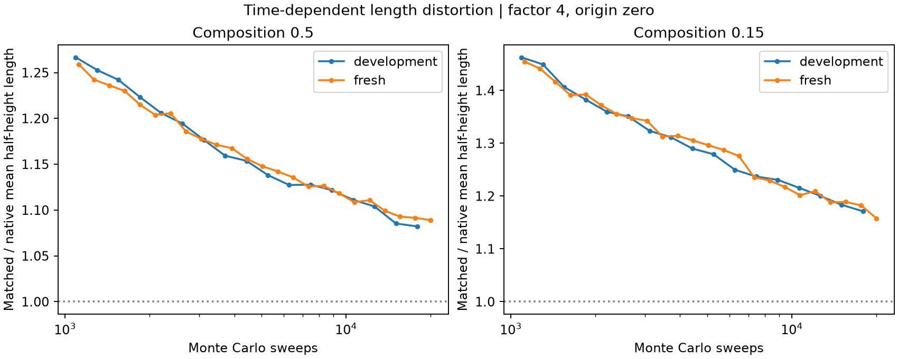

# Ising coarsening: how much does the measurement matter?

I'm Django, a 19-year-old student interested in materials science. This project
started with a simple question: how do domains grow after a material is cooled?
It has developed into a study of how the way we measure those domains changes
the result.

[Research summary](docs/ACADEMIC_REVIEW_BRIEF_2026-09-20.md) · [Live Model A demo](https://djangothompson12-alt.github.io/ising-monte-carlo/) · [Notes and methods](docs/README.md)

**Review snapshot, 4 October 2026:** start with the [review guide](review/README.md)
for the two-page PDF, reproducible evidence download and suggested checks.
This is a working research draft shared for criticism, not a finished or peer-reviewed paper.

## The models

- **Model A:** Metropolis single-spin flips. Magnetisation can change.
- **Model B:** Kawasaki exchanges between neighbouring sites. The number of
  each species stays fixed, making it a simple model of a binary mixture.

Both have interactive visualisers. Model B also allows unequal horizontal and
vertical couplings and different mixture ratios. The main controlled study
uses equal couplings, two compositions and several lattice sizes.

## What I've been investigating

The expected late-time growth law for diffusion-controlled Model B coarsening
is `length ∝ time^(1/3)`. My early fitted slopes were lower. Instead of treating
that as a new law, the project tests run length, lattice size, fitting window
and the definition of domain size.

The longer study contains **128 independent trajectories**, across four sizes
and two compositions, each run to one million sweeps. It shows that measured
slopes depend on the window and observable; smaller lattices can also limit growth.

The latest question is narrower: **if a lower-resolution image keeps the correct
species fraction, does it also keep the measured growth exponent?** In a separate
16-run check, matching the fraction did not remove the exponent shift. Simple
images with known lengths help check what the measurement pipeline is doing.



*The processed/native mean-length ratio changes during the fit window. A constant
multiplicative error would leave the log-log slope unchanged; a changing error can alter it.
[Results, uncertainty and limits](docs/GROWTH_RELIABILITY_RESULTS_2026-09-19.md).*

## Why materials science?

Microstructure matters for material properties, but a length measured from an
image depends on how that image is processed. Alongside the simulations, there
is a small tool for checking resolution sensitivity in supplied phase masks,
with examples using public alloy images.

This is **not a calibrated model of a real alloy**, an experimental growth-law
measurement or a tool already validated by a laboratory. The report is still
a working draft, and the originality of the narrower question needs criticism.

## Try it

The [Model A demo](https://djangothompson12-alt.github.io/ising-monte-carlo/) runs
in a browser. For Python tools, Python 3.11 is the tested starting point:

```bash
git clone https://github.com/djangothompson12-alt/ising-monte-carlo.git
cd ising-monte-carlo
python3 -m venv .venv
source .venv/bin/activate
python -m pip install -r requirements.txt
solara run model_b/solara_app.py
```

On Windows, activate with `.venv\Scripts\activate`.
The first simulation step can take longer while Numba compiles.
See the [technical guide](docs/TECHNICAL_GUIDE.md#installation) for installation notes.

To run the tests and a small, synthetic measurement check without starting a long simulation:

```bash
python -m unittest discover -s tests -v
python -m research.geometry_controls --output output/my_geometry_check
```

Open the generated `report.html`. Use a new output folder for each check.
These designed images are a measurement test, not an alloy experiment.

## Where things are

| Folder | Contents |
|---|---|
| [model_a/](model_a/) and [model_b/](model_b/) | Simulation engines and visualisers |
| [research/](research/README.md) | Experiments, analysis, protocols and data |
| [docs/](docs/README.md) | Results, physics notes and limitations |
| [manuscript/](manuscript/README.md) | Working report and earlier drafts |
| [tests/](tests/) | Numerical and software checks |

For the development of the project, see [progress and limits](docs/PROGRESS_AND_LIMITS.md).
For exact datasets and reproduction commands, see the [data guide](research/DATA_README.md).

## Help and feedback

This project has used substantial AI assistance in code, study design, analysis
and drafting. [The contribution record](AI_USE_AND_CONTRIBUTIONS.md) explains that
in detail. I am responsible for checking and understanding what I present.

Technical criticism is welcome, particularly on the measurement choices and
closest prior work. [The short review brief](docs/ACADEMIC_REVIEW_BRIEF_2026-09-20.md)
sets out three specific questions. No peer review or external endorsement is claimed.
