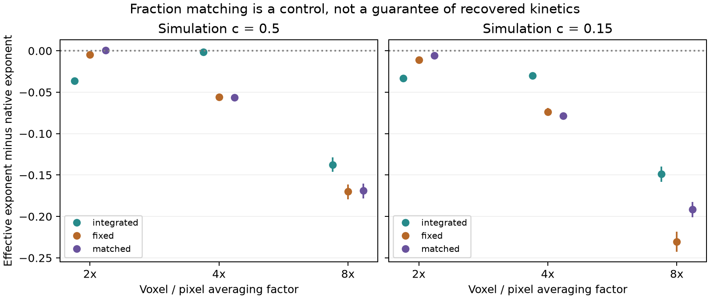
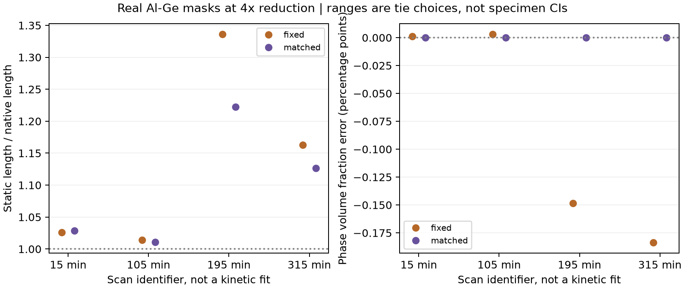

# Does preserving composition preserve the measured growth exponent?

## Short answer

Not necessarily. In the primary fourfold image-reduction test, matching the
native fraction did not recover the native fitted exponent. The 50:50 case
is particularly clear: the fraction is matched exactly, but the fitted
exponent still shifts. This is a result for this processing rule, observable
and dataset, not a new growth law or proof that every fraction-constrained
segmentation method fails.

The [literature assessment](ORIGINALITY_AND_NEXT_QUESTION_2026-09-19.md)
explains why the possible contribution is a small quantitative dynamic
benchmark. Resolution effects and the fact that fraction alone does not
determine geometry are already established. Originality is not certified.

## What was actually tested

The analysis reuses 32 completed L=128 Kawasaki trajectories at T=0.65 Tc:
16 at nominal c=0.50 and 16 at c=0.15, with isotropic couplings. No new Monte
Carlo trajectories were launched for this test. Each trajectory has 75 saved
states. The simulation dynamics and original archives were not changed.

For every state, compare:

1. The native binary image.
2. Block means, retaining intermediate values between zero and one.
3. The block means thresholded at 0.5.
4. The same block means ranked into a binary image with the nearest attainable
   foreground count to the native count fraction.

Reduction factors are 2, 4 and 8. Five fixed random coordinate orderings
resolve equal-valued pixels at the selection boundary. They are averaged
within each trajectory for the primary matched estimate, not counted as
five independent simulations. This control deliberately knows the native
fraction; it is not an automatic method for discovering unknown fractions.

The measured length is the mean directional half-height length of the
normalized connected, finite-image correlation. This is an image-observation
experiment, not a replacement of the simulation engine's periodic estimator.
Fits are log-log regressions of the ensemble-mean length. Comparisons retain
only times resolved in every trajectory and processing variant, including
every tie ordering. A resolved crossing can still lie below one coarse pixel;
it is not evidence of adequate spatial resolution.

The [protocol](../research/FRACTION_MATCHED_PROTOCOL_2026-09-19.md) was fixed
before calculating this new control, but after the earlier processing effect
was known. This is therefore exploratory follow-up, not preregistered
confirmation on untouched data.

## Primary result

Factor 4; nominal 1,000–20,000 sweeps. Both compositions retain 17 common
checkpoints from 1,091 to 17,913 sweeps. Confidence intervals are percentile
intervals from 500 paired, whole-trajectory bootstrap resamples. They reflect
replica sampling, not model error or uncertainty about the real alloy.

| Nominal composition | Native exponent | Fixed-threshold exponent | Fraction-matched exponent | Matched minus native, 95% interval |
|---|---:|---:|---:|---|
| 50:50 | 0.23369 | 0.17779 | 0.17737 | −0.05632 [−0.05885, −0.05331] |
| 15:85 | 0.23197 | 0.15808 | 0.15356 | −0.07841 [−0.08222, −0.07452] |

For 50:50, native and matched fractions are both exactly 0.5. For nominal
15:85, the actual native fraction is 0.1500244141; the matched coarse fraction
is 154/1024 = 0.150390625. The residual 0.0003662109 lies within the allowed
half-count bound of 0.00048828125. The latter is approximate matching, not
exact conservation on the coarse grid.

Keeping the unthresholded means gives exponents 0.23224 and 0.20191,
respectively. Thus the processing response also depends on composition.
None of these comparisons estimates a new asymptotic exponent: even the
native reference is a finite-window measurement, not an established 1/3 law.

The matched point estimates are not closer to native than the fixed-threshold
ones at factor 4. This alone does not establish that matching is significantly
worse; the reported intervals compare each treatment with native, not the
two treatments directly.

## Sensitivity, including results that qualify the main message

At factor 2, matching does help in these fits: the 50:50 delta is +0.00049
[−0.00023, +0.00127], while the 15:85 delta is −0.00559
[−0.00732, −0.00347]. An interval containing zero is not proof of equivalence.
It would be wrong to conclude that matching never helps. The narrower
conclusion is that matching fraction is not a sufficient general guarantee.

Points compare each treatment with its own paired native reference. Bars are
95% paired bootstrap intervals. The c=0.15 factor-8 primary fit drops one
unresolved checkpoint and starts at 1,300 sweeps; the other primary fits
start at 1,091. This small difference is disclosed, not treated as an exactly
identical cross-factor window. Factor 8 deliberately tests severe loss of
resolution, not a recommended measurement setting.

The longer nominal 1,000–200,000 window retains times through 173,983 sweeps.
At factor 4, matched-minus-native remains negative: −0.03583 for 50:50 and
−0.05478 for 15:85. These secondary fits do not replace the primary window.
All 36 fits, including different retained ranges, are in the
[complete table](../research/results/fraction_matched_benchmark_2026-09-19_v1/simulation_fits.csv).

## External test on real alloy masks

The same operators were applied to four previously fixed 256³ regions of
published Al–Ge nano-CT phase masks, with native 0.06 micrometre voxels:
[Jonas Fell (2023), Mendeley Data v1, CC BY 4.0](https://data.mendeley.com/datasets/hj9njz3rxp/1).
No region was moved to improve these results. At factor 4 the voxel spacing
is 0.24 micrometres. The static length ratio compares the processed mask with
its own native region, not a simulated exponent with an experimental exponent.

| Scan identifier | Fixed/native length | Matched/native length, mean of five tie choices | Tie range |
|---|---:|---:|---|
| 15 min | 1.02609 | 1.02864 | 1.02864–1.02864 |
| 105 min | 1.01392 | 1.01088 | 1.00996–1.01169 |
| 195 min | 1.33642 | 1.22218 | 1.22048–1.22337 |
| 315 min | 1.16275 | 1.12638 | 1.12370–1.12821 |

For the 195-minute and 315-minute boxes, matching reduces the length change
but leaves approximately 22.2% and 12.6% above the native measurement. These
are not accuracy errors against independently known physical truth. Some
directional lengths are below one coarse voxel, and the native boxes have
sparse, heterogeneous Ge. The tie ranges quantify algorithmic choices, not
specimen uncertainty. No representative-volume or cross-time registration
claim has been established. Consequently, no experimental ageing exponent
is fitted, and the scan labels are not used as a kinetic validation.

The dataset authors distinguish Ge populations and apply their own image
processing before object-size measurements. Their particle-length statistic
is not our all-Ge correlation length; numerical agreement would not be an
appropriate validation target. See [Fell et al., section 3.5](https://publica-rest.fraunhofer.de/server/api/core/bitstreams/67141d92-229c-4890-9d39-2fa277b70a49/content).

## Verification and remaining limitations

- Complete inventory: 57,600 simulation observations, 96 external observations,
  36 fit rows; no duplicated simulation keys. Every matching residual obeys
  its count bound, and block integration preserves the mean.
- Original factor-4 fixed-threshold results agree with the previous analysis
  wherever the retained time masks agree.
- A separately coded check used explicit block loops, full sorting instead
  of partitioning, and direct pair products instead of FFT correlations.
  All 480 selected matched measurements agreed to within 3.56 × 10⁻¹⁵.
- Both primary paired differences and their original confidence intervals
  were independently recalculated within this assistant's verification code.
  With 5,000 bootstrap draws the intervals remain negative: approximately
  [−0.05913, −0.05324] and [−0.08237, −0.07417]. Leaving out any single
  trajectory preserves the negative difference.
- The full repository test suite passes: 151 tests. Scientific figures were
  visually inspected. The new HTML report's source and generated content
  were tested, but its browser interactions have not been visually checked.

These are internal, AI-assisted checks, not independent academic review.
The [verification record](../research/results/fraction_matched_verification_2026-09-19_v1/verification.json)
and [table/figure checks](../research/results/fraction_matched_summary_2026-09-19_v1/verification_and_summary.json)
record provenance. The original inputs remain unchanged.

Untested limitations include block-grid origin, realistic blur/noise,
other segmentation algorithms, other dynamic observables, and independent
experimental mask accuracy. The control does not identify a unique causal
mechanism for the residual. It does not establish that the original low
Kawasaki exponent arose only from observation, or settle the finite-size
versus finite-time question.

## What is ready to show, and what comes next

The [combined results report](../research/results/fraction_matched_benchmark_2026-09-19_v1/report.html)
and [standalone external example](../research/results/fraction_matched_external_2026-09-19_v1/report.html)
are ready for internal reading and bounded criticism. See
[tool instructions](FRACTION_MATCHED_EXTERNAL_TOOL.md) for running an
owner-approved mask. Reproduction needs the raw trajectory archives and
separately obtained third-party data, not just this document.

Before approaching a reviewer, Django should be able to explain the four
processing stages, reproduce one paired comparison, and distinguish
composition from phase volume fraction. Ask the reviewer:

1. Which prior work most directly overlaps this dynamic, fraction-matched
   benchmark? Is there a useful small contribution left?
2. Is the half-height length and shared-window inference appropriate, or
   should a second observable be the primary check?
3. Would the static tool answer a real imaging decision, and what independent
   reference and acceptance tolerance would make that test meaningful?

An owner-led test should fix its region, statistic and acceptable error before
running. Public-data reuse alone is neither adoption nor external endorsement.
The existing four-page PDF predates this control and must be updated before
being sent as the current expanded result. Student understanding, source
reading and honest acknowledgement of AI assistance remain necessary.
