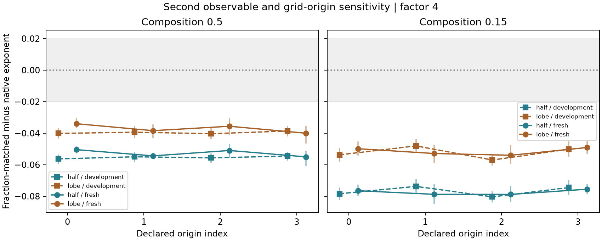

# Independent measurement check: results and limits

## Outcome

The factor-4 fraction-matched exponent shift repeated in a fresh simulation
ensemble, survived four grid origins, and remained present with a second
length definition. This strengthens the numerical evidence for the effect.
It does not establish novel physics or a useful new diagnostic.

Both fixed warning screens flagged every origin-zero half-height comparison,
including five comparisons with small paired exponent differences. They have
no acceptance coverage in this short-window test. That negative result is
retained; thresholds were not relaxed after seeing the new data.

Read the [illustrated review brief](../research/results/growth_reliability_summary_2026-09-19_v1/review_brief.html)
first. It is an AI-assisted working brief for student checking, not the final
student-authored paper. The old PDF and private review pack are historical.

## What was completed

- Development audit: 32 existing L=128 trajectories, two compositions,
  three image-reduction factors, four grid origins, two length definitions,
  three processing stages and five fraction-matching tie choices.
- Frozen protocol and source hashes before generating the new batch. New
  seeds were checked against six existing campaigns and the timing-only seed.
- Sixteen new L=128 simulations: eight per composition, each to 20,000
  sweeps at 0.65 Tc, with Jx=Jy=1. These are separate from the older long-run
  physics campaigns. They were not run to finite-size saturation.
- Fresh cohort analysed using the unchanged frozen sources and thresholds.
- Static Al-Ge companion extended to two observables and explicit
  resolution warnings, without fitting real ageing kinetics.
- Raw-data, saved-observable, initial heat-interval and test-suite checks.

## New-seed result

Primary comparison: fraction-matched minus native, factor 4, origin (0,0).
The fresh fits retain all 24 available checkpoints from 1,119 to 20,000 sweeps.
The declared window is 1,000–20,000; development fits have a different
checkpoint grid, retaining 17 points from 1,091 to 17,913. They are separate
ensembles, not a pooled estimate. Confidence intervals use 1,000 paired
whole-trajectory bootstrap draws. Eight trajectories per condition give a
bounded first check, not precise universal performance estimates.

| Composition | Length definition | Native exponent | Matched exponent | Difference, 95% interval |
|---|---|---:|---:|---|
| 50:50 | Half-height (primary) | 0.23141 | 0.18094 | −0.05047 [−0.05293, −0.04782] |
| 15:85 | Half-height (primary) | 0.24214 | 0.16563 | −0.07651 [−0.08006, −0.07255] |
| 50:50 | Positive-lobe integral | 0.22349 | 0.18946 | −0.03403 [−0.03699, −0.03039] |
| 15:85 | Positive-lobe integral | 0.23475 | 0.18489 | −0.04986 [−0.05429, −0.04518] |

The positive-lobe measure integrates the normalized directional covariance
to its first zero. A missing zero remains unresolved rather than being
replaced by a truncated length. This is another correlation-based length,
not an entirely independent imaging modality or particle radius.

At factor 4, all four origin choices retain the negative difference beyond
the declared 0.02 tolerance for both observables and compositions in both
cohorts. In the fresh cohort, half-height differences range from −0.05503 to
−0.05047 at 50:50, and −0.07883 to −0.07555 at 15:85. Origins translate both
the block grid and the finite observation window on a periodic simulation;
those two contributions have not been isolated. No real image was wrapped.



Bars are paired 95% intervals; the shaded ±0.02 band is a declared numerical
benchmark tolerance, not an externally accepted engineering requirement.
Origin indices follow the protocol. Sensitivity comparisons share trajectories
and are not independent additional simulation experiments.

## What the time-dependent error explains


In the new 50:50 ensemble, the matched/native mean-length ratio falls from
1.259 to 1.089 over the fitted window. For 15:85, it falls from 1.455 to 1.158.
Thus image processing inflates the early lengths more than the late lengths,
flattening the log-log growth curve.

For the same time grid and ordinary least-squares weights, linearity gives

    fitted exponent difference = slope of log(mean processed / mean native)

This is an exact accounting identity, not a newly proposed theoretical law
or independent prediction. It was verified using constant 10% errors and
known time-dependent powers, and on every resolved fit. The ratio must be
the ratio of ensemble means; substituting the mean of per-trajectory ratios
would generally change the result. The identity does not identify the unique
geometrical cause of the distortion.

## Published-method comparison: what was and was not implemented

[Ledesma-Alonso et al. (2018)](https://arxiv.org/abs/1712.03183) define a
near-zero descriptor length and use Eq.34's floor/ceiling rule to set the
allowed reduction. Relevant PDF pages 8 and 11 were visually checked.
The code implements that rounding algebra, with known-answer tests.

Our `directional_02_adaptation` supplies the minimum native directional
covariance length to that algebra and requires every retained snapshot to
pass. It does **not** reproduce their full minimum over phases and descriptors,
their ensemble-descriptor construction, or their complete image-generation
and decimation study. It is a labelled partial adaptation, not a faithful
full-method benchmark. Its failure cannot refute their published method.

The second screen requires all processed directional half-height lengths
to span at least three coarse pixels. That is our declared conservative
heuristic, not a published theorem or newly trained method.

| Cohort | Screen | Compared cases | Accepted | Flagged although within tolerance |
|---|---|---:|---:|---:|
| Development | Directional adaptation | 18 | 0 | 5 |
| Development | Three-pixel heuristic | 18 | 0 | 5 |
| Fresh | Directional adaptation | 18 | 0 | 5 |
| Fresh | Three-pixel heuristic | 18 | 0 | 5 |

Cases are the two compositions × three factors × three processing treatments,
with origin zero and half-height only. `Within` means the entire paired
95% interval lies inside ±0.02. Unknown/unresolved cases are retained in the
full tables. There is no independent-case accuracy confidence interval.
Zero accepted cases is not a successfully validated diagnostic. We should
not invent a looser rule and reuse this batch as untouched validation.

## External build

The [extended static report](../research/results/external_length_reliability_2026-09-19_v1/report.html)
uses the same four declared Al-Ge boxes, original source hashes and 0.06 µm
native voxel calibration. It reports half-height and positive-lobe lengths,
their native-relative ratios, phase-fraction residuals and resolution warnings.
The CSV retains all five tie outcomes; no experimental region is moved to
improve a result. All lengths in this public example are in micrometres.

Source: [Fell (2023), Mendeley Data v1](https://data.mendeley.com/datasets/hj9njz3rxp/1),
CC BY 4.0. Real static masks test an observation procedure, not simulated
kinetics. They are assumed references, not independent ground truth. The
three-pixel warning is not a validated kinetic classifier for real images.
Browser usability and outside usefulness have not yet been verified.

Run a new owner-approved plan with the existing project dependencies:

```bash
python -m research.external_length_reliability path/to/plan.json \
  --output output/new_static_length_check
```

The plan schema is the same as the [fraction-matched tool](FRACTION_MATCHED_EXTERNAL_TOOL.md).

## Verification and reproduction

The full suite passed 157 tests. All 16 new seeds were unique; 1,120 saved
snapshots passed spin/conservation/energy checks. Independently recomputed
stored periodic observables covered 2,240 directional lengths, with maximum
length difference 1.34 × 10⁻¹⁵. The first heat interval was also checked by
replaying the initial preparation and evaluating the Hamiltonian separately;
all 16 agreed exactly. This still uses the same dynamics kernel and is not
an independent experimental validation.

- [Frozen protocol](../research/GROWTH_RELIABILITY_PROTOCOL_2026-09-19.md)
- [Pre-generation source/seed freeze](../research/results/growth_reliability_freeze_2026-09-19_v1.json)
- [Fresh analysis and all comparisons](../research/results/growth_reliability_fresh_2026-09-19_v1/report.html)
- [Saved-observable verification](../research/results/growth_reliability_raw_observables_2026-09-19_v1.json)
- [First heat-interval verification](../research/results/growth_reliability_first_energy_2026-09-19_v1.json)

Reproduce the saved-data analysis without launching more simulations:

```bash
python -m research.audit_growth_reliability \
  research/runs/growth_reliability_holdout_v1 --cohort fresh \
  --freeze research/results/growth_reliability_freeze_2026-09-19_v1.json \
  --output output/new_growth_reliability_analysis
```

The new raw batch currently resides locally under `research/runs/` and is
ignored by Git. No push or public release occurred. A later release needs
explicit selection of those archives and their source/protocol records.

## Decision before doing more

Ready: a bounded criticism request with stronger replication, the time-error
accounting, observable/origin sensitivity, transparent uncertainty and a
negative diagnostic result. Not ready: a claim that a useful new method,
original physics or publication-grade literature gap has been established.

A full prior-method comparison remains unfinished. In particular, applying
the pore-size descriptor to pixel-scale thermal defects versus denoised phase
domains is a scientific choice that must be justified, not silently tuned to
improve coverage. Request specialist criticism of that choice and of the
usefulness of the dynamic benchmark before adding many more simulations.
The next external pilot also needs an owner-defined statistic and acceptable
error fixed before its results. Student understanding and AI disclosure are
part of the report, not optional finishing touches.
